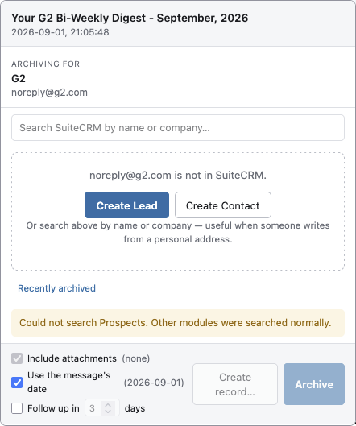
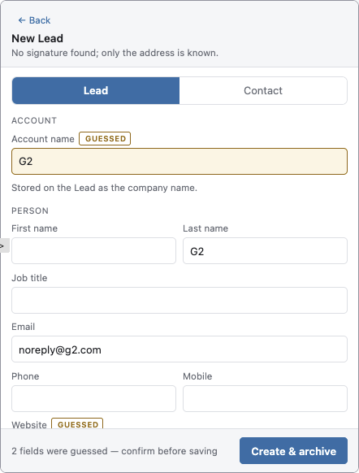
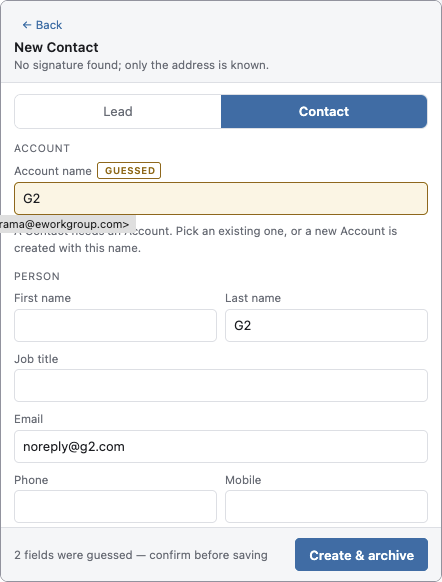
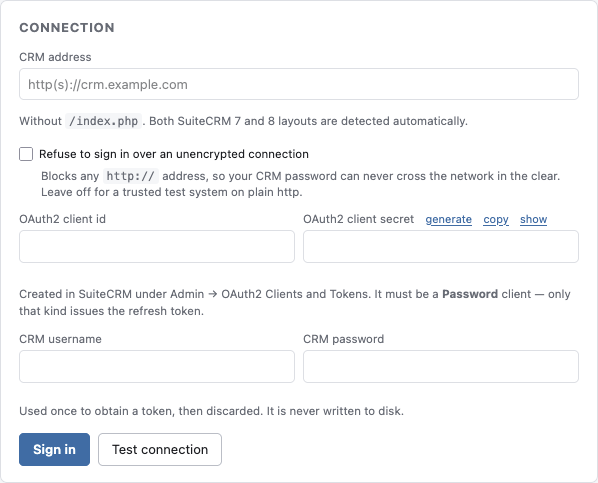
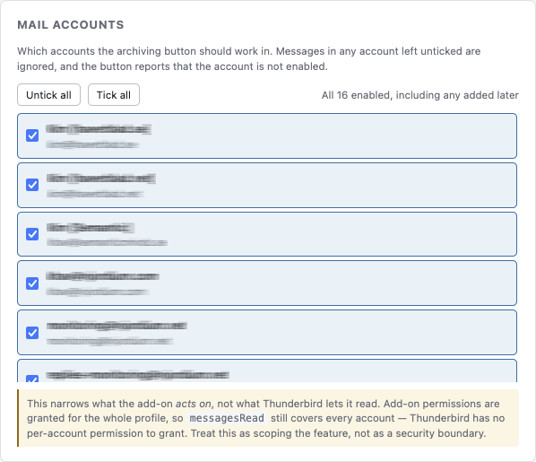
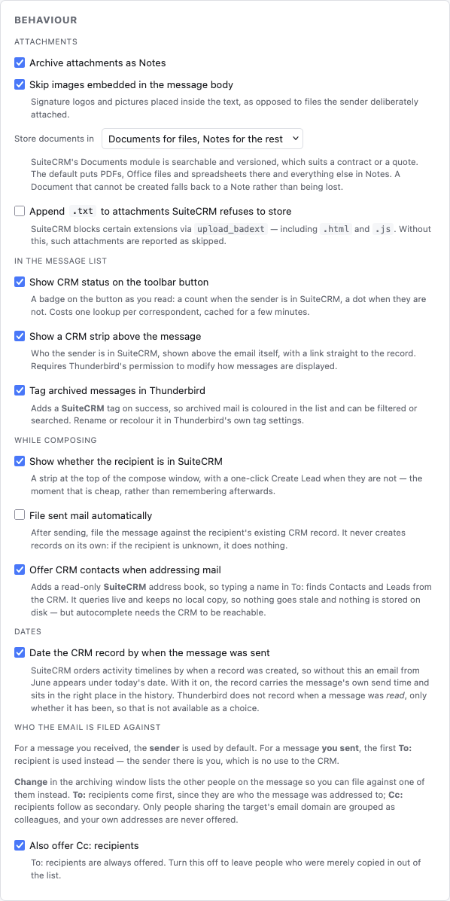

# SuiteCRM Email Archiver for Thunderbird

[](LICENSE)
[](https://www.thunderbird.net/)
[](https://developer.thunderbird.net/add-ons/mailextensions)
[](package.json)
<!-- Uncomment when the ATN listing is approved and live:
[](https://addons.thunderbird.net/en-US/thunderbird/addon/suitecrm-email-archiver/)
-->

> Njordium-authored Thunderbird MailExtension for **SuiteCRM 7 and 8**. Thunderbird **140 ESR
> to 155**, Manifest V3, OAuth2 against the **V8 REST API** with a rotating refresh token,
> simultaneous lookup across Leads, Contacts, Accounts and Targets, record creation from
> parsed email signatures, attachments as Notes, whole-thread archiving, and no runtime
> dependencies.

Archive an email into a SuiteCRM Lead, Contact, Account or related record, without choosing
a module or typing a search first. The sender's address is already in the message, so the
add-on uses it: one click searches every address-bearing module at once and offers what it
found.

When the sender is not in the CRM yet, it reads their signature block and offers to create a
Lead, or a Contact under an Account, with the fields filled in and anything uncertain marked
for you to confirm.

---

## Screenshots

The archiving window when the sender is not in the CRM yet, the address is already
resolved, so the only decision left is Lead or Contact.



Creating the record. Anything the parser inferred rather than read is marked **GUESSED**,
with a count in the footer, so nothing uncertain is saved without being seen.

| | |
| --- | --- |
|  |  |

Settings, the connection, with a generator for the OAuth2 client secret; what the add-on
does as you read and compose; and which mail accounts it acts in.

| | |
| --- | --- |
|  |  |



---

## Highlights

### Finding the record

- **Every module searched at once.** One click fans out across Leads, Contacts, Accounts and
  Targets in parallel and groups the hits by module. No module to pick, no search to type. A
  single match is pre-selected, so archiving is one further click.
- **Colleagues on the sender's domain, one click away.** Wrong person? *Change* lists the
  other people on the message, To: before Cc:, each labelled with how many CRM records they
  already have. Other domains sit behind a toggle, and your own addresses are never offered.
- **Sent mail targets the recipient, not you.** On a message you sent, the first To:
  recipient is the default, because the sender is you and of no use to the CRM.
- **Related records reached through real relationships.** Contacts and Accounts expand in
  place so the email can be filed against a linked Opportunity, Quote, Case or Project, not
  found by a name-LIKE guess that rarely matches.
- **It remembers.** Where you last filed mail from an address is pre-selected next time, and
  a *Recently archived* list is one click away.
- **Right-click, or use the keyboard.** A context menu files one message or twenty against
  the record that sender's mail went to last time. `Alt+Shift+S` opens the window,
  `Alt+Shift+A` files without one, and both are re-bindable in Thunderbird's own settings.
- **Search only the modules you use**, and add ones you do. A customised SuiteCRM can keep
  the people who matter in a module this add-on would otherwise never look at.

### Archiving

- **Attachments become Notes**, with inline images skipped by default. When SuiteCRM's own
  `upload_badext` policy rejects a file, you are told which one and why rather than left with
  a silent gap; renaming blocked extensions so they upload is an opt-in setting.
- **The record carries the message's own sent date**, so an older message lands at the date
  it was written rather than the day you filed it, and the activity timeline stays in order.
  Switchable globally or per message.
- **Whole conversations in one action.** The thread is rebuilt from the message's own
  `References` chain, so messages that merely share a subject are excluded.
- **Archived twice is re-filed, not duplicated.** Matching is on `message_id`, so filing the
  same email against a different record moves it rather than creating a second copy.
- **Archived mail is tagged in Thunderbird**, so you can see at a glance what is already in
  the CRM, and a badge on the toolbar button counts the sender's CRM records.

### Creating records from an email

- **Filled in from the signature block, headers and any attached vCard.** All of it parsed on
  your own machine; no message content is sent anywhere except your CRM.
- **The signature is found by its sign-off**, not by guessing at the last few lines, so a
  greeting or a paragraph of the body is never mistaken for contact details.
- **Your own signature is never harvested from a reply.** A block whose addresses are all on
  other domains belongs to someone else and is discarded.
- **Uncertain fields are marked, never saved quietly.** Anything guessed is highlighted with
  a count before you save. Swedish, Norwegian and Danish signatures are handled, including
  compound job titles and labelled phone numbers, `M:`, `Mobil:`, `Tel:`, `Direkt:`, `Fax:`
  each land in the right CRM field, and `Växel:` is recognised as a switchboard rather than
  filed as someone's direct line.
- **Possible duplicates are surfaced first**, so a second record for someone who already
  exists takes a deliberate click.
- **Or turn the email into work.** *Create record…* makes a Case, Opportunity, Meeting or
  follow-up Task linked to the selected record and files the email against it in the same
  action, offering only the kinds SuiteCRM will actually link.

### Signing in

- **OAuth2 against the V8 REST API**, not the legacy `v4_1` endpoint.
- **Your CRM password is never stored.** It is exchanged once for tokens and discarded. Only
  a refresh token is kept, and it is replaced every time it is used.
- **A Thunderbird upgrade does not sign you out.** Access tokens last an hour and renew
  silently; the sign-in window is a month and resets on every use, so ordinary use means
  never signing in again.
- **Revocation without collateral damage.** An administrator deletes that one token under
  *Active OAuth2 Tokens* and Thunderbird is locked out at once, no password change, nothing
  else disturbed.
- **The API path is detected automatically**, whether it sits at `/Api` or `/legacy/Api`.

### Safeguards

- **One host permission, for your CRM only.** No third-party site is ever contacted, a
  website guessed from the sender's domain is filled in for you to check, not fetched.
- **No `innerHTML` anywhere.** Every value from an email or the CRM reaches the page as text,
  so a crafted signature cannot execute in an extension page.
- **Shareable debug reports with secrets and hosts masked**, including percent-encoded forms,
  and the CRM hostname whether or not it carries a port.
- **Optional refusal to sign in over plain http**, since a password would otherwise cross the
  network in the clear.
- **No dependencies and no remote code.** Nothing is loaded at runtime; the whole add-on is
  136 KB.

---

## How the flow works

1. Open an email, click the SuiteCRM button.
2. The sender's address is looked up across **Contacts, Leads, Accounts and Targets at once**.
3. Hits appear grouped by module. Click one, click Archive. A single hit is pre-selected.
4. Wrong person? *Change* lists the other recipients **on the sender's domain**, each labelled
   with how many CRM records they already have.
5. Nobody found? Create a **Lead** or a **Contact under an Account**, with the form pre-filled
   from the signature block, the message headers, and any attached vCard. Fields the parser is
   unsure of are highlighted for you to confirm, nothing uncertain is saved silently.

Contacts and Accounts can be expanded in place to file the email against a linked
Opportunity, Quote, Case or Project instead.

## The two buttons on the archiving window

They do different jobs, and the difference is not obvious from the labels.

**Archive to `<module>`** files *this email* against the selected record, the message, its
attachments, and the message's own sent date if that option is ticked. It appears in that
record's history in SuiteCRM. This is the ordinary action.

**Create record…** turns the email into a *new record of a different kind*, linked to the selected
one. It opens a second screen offering four, each pre-filled from the message:

| Kind | Name | Other fields |
| --- | --- | --- |
| Case | subject |, |
| Opportunity | subject | amount `0`, close date +30 days, stage `Prospecting` |
| Meeting | subject | tomorrow 09:00, 1 hour |
| Follow-up task | `Follow up: <subject>` | due +3 days, 09:00 |

*Also file this email against it* is ticked by default, so Create record… does both in one action:
the new Case (or whatever) **and** the archived email. Use it when the email is not just
correspondence to keep but something to act on.

Note that **Create record… is not how you create a Lead or a Contact.** That is a separate screen,
offered only when the sender matches nothing in the CRM. Once a record exists for the sender,
Create record… is about the work arising from the email, not about the person.

### What each kind links to

SuiteCRM's data model decides this, not the add-on, and it is not uniform.
Verified by attempting each relationship against a live instance:

| Selected | Case | Opportunity | Meeting | Follow-up task |
| --- | --- | --- | --- | --- |
| **Contact** | yes | yes | yes | yes |
| **Account** | yes | yes | yes | yes |
| **Lead**, converted | yes, to its Account | yes | yes | yes |
| **Lead**, not converted | not offered | yes | yes | yes |
| **Target** | not offered | not offered | yes | yes |

Meetings and Tasks always link, because SuiteCRM lets an activity name any module
as its parent. Cases hang off an Account: a Contact or Account supplies one
directly, and a *converted* Lead supplies one through `account_id`. Opportunities
additionally have a `leads` relationship, which is why an unconverted Lead can
take one. Targets relate to neither.

**A kind that cannot be linked is not offered.** The picker shows only what will
actually attach, and says why the others are missing, a Case created against a
Target would otherwise be attached to nobody, under a form claiming it was linked.
If you need one, convert the Lead or Target in SuiteCRM first.

## Setup

The CRM needs a one-time OAuth2 client. See **[docs/SETUP.md](docs/SETUP.md)**, it also
records the current state of the test instance.

Then verify the server end-to-end before touching Thunderbird:

```bash
export CRM_URL=http://crm.example.com:8484
export CRM_CLIENT_ID=... CRM_CLIENT_SECRET=... CRM_USERNAME=...
read -rs CRM_PASSWORD && export CRM_PASSWORD

node tools/verify-crm.mjs --write
```

## Install

Requires Thunderbird **140 ESR or newer**. 140 is the current ESR; 128 reached end of life.

<!-- Uncomment when the ATN listing is approved and live:
**From addons.thunderbird.net** (recommended): install from
[the listing](https://addons.thunderbird.net/en-US/thunderbird/addon/suitecrm-email-archiver/).
Updates arrive automatically.
-->

**From a release**: download the `.xpi` from
[Releases](https://github.com/njordium/thunderbird_suitecrm_archiver/releases), then in
Thunderbird go to **Add-ons and Themes**, the gear icon, **Install Add-on From File**.
Checksums are published alongside each release. Installs made this way do not update
themselves.

Setting up the SuiteCRM side takes one action by an administrator: see
**[docs/SETUP.md](docs/SETUP.md)**, or the add-on's own Preferences tab, which walks through
it and generates the client secret for you.

## Build from source

```bash
./tools/build.sh          # validate, test, package to dist/*.xpi
npm test                  # 301 unit tests, no CRM required
./tools/review.sh         # Thunderbird's API linter, the reviewers' linter, and the store validator
git config core.hooksPath tools/hooks   # once per clone, see below
```

`tools/build.sh` refuses to package an add-on carrying a tool-attribution marker, in the
tree, in a commit message, in commit authorship, or inside the `.xpi`. By the time the build
says so a bad commit message is already in history and only a rewrite gets it out, so the
`commit-msg` hook in `tools/hooks` checks the message you are writing instead. Setting
`core.hooksPath` once per clone turns it on.

There is no build step in the usual sense: the files in `src/` are the files that ship. To run
it without packaging, use **Tools → Developer Tools → Debug Add-ons → Load Temporary Add-on**
and point at `manifest.json`.

## Why the password grant, and not a redirect flow

SuiteCRM registers an `AuthCodeGrant` on its OAuth2 server but exposes **no `/authorize`
route**, there is no endpoint that can issue an authorization code, so
`identity.launchWebAuthFlow` has nothing to point at. Upstream issue
[#7854](https://github.com/salesagility/SuiteCRM/issues/7854) has been open since 2019.

The password grant is therefore the only user-attributed option. It is used exactly once; the
password is never written to disk, and only the rotating refresh token is kept.

Full reasoning, with the source that proves it: **[docs/RESEARCH.md](docs/RESEARCH.md)**.

## Layout

```
manifest.json           MV3, event page, no service worker
src/background/         all CRM traffic (keeps requests out of CORS scope)
src/lib/auth.js         OAuth2, single-flight refresh, token rotation
src/lib/crm.js          V8 client, the filter contract lives here
src/lib/resolver.js     parallel multi-module address lookup
src/lib/signature.js    local-only contact extraction (vCard > signature > headers)
src/lib/archive.js      Emails record, message_id de-dup, attachments as Notes
src/ui/                 popup and settings
tools/verify-crm.mjs    end-to-end server probe
docs/RESEARCH.md        what was learned from the SuiteCRM and Thunderbird sources
```

## Licence

**Mozilla Public License 2.0**, the same licence as Thunderbird itself. See
[LICENSE](LICENSE).

MPL is file-level copyleft: you may use, modify and redistribute this, including
alongside proprietary code, but any file you change and ship must stay under the
MPL and its source made available. Every source file carries the notice from the
licence's Exhibit A, so the terms travel with a file even if it is copied out of
this repository on its own.
